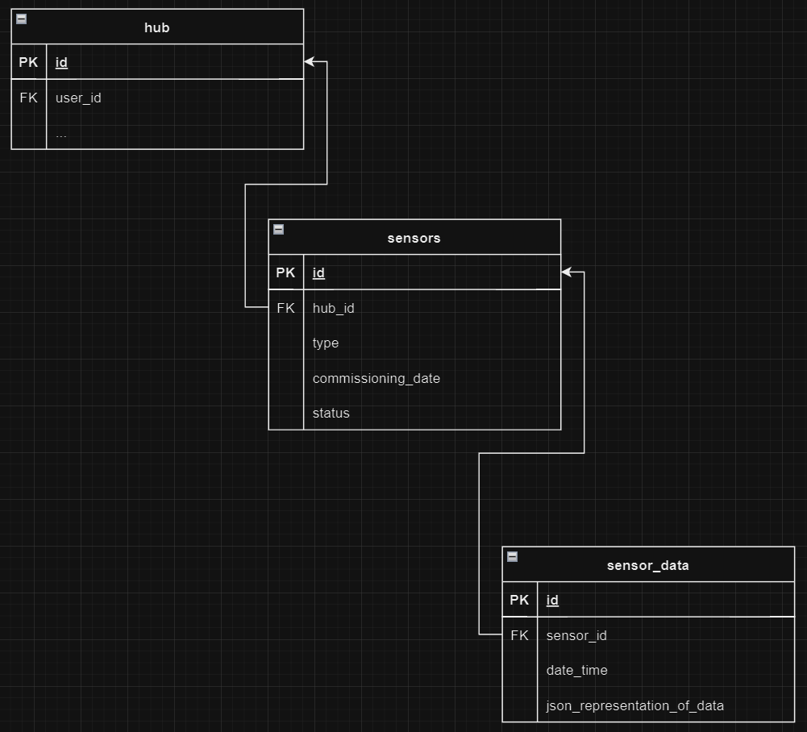
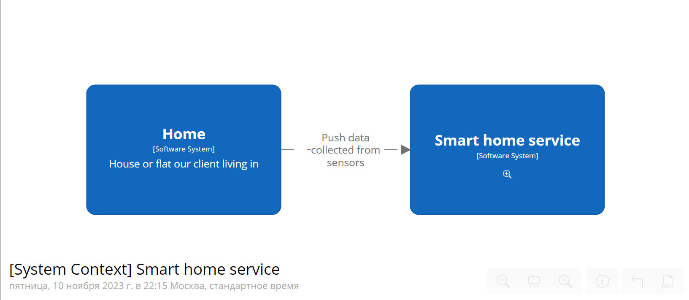
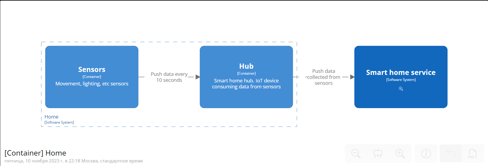
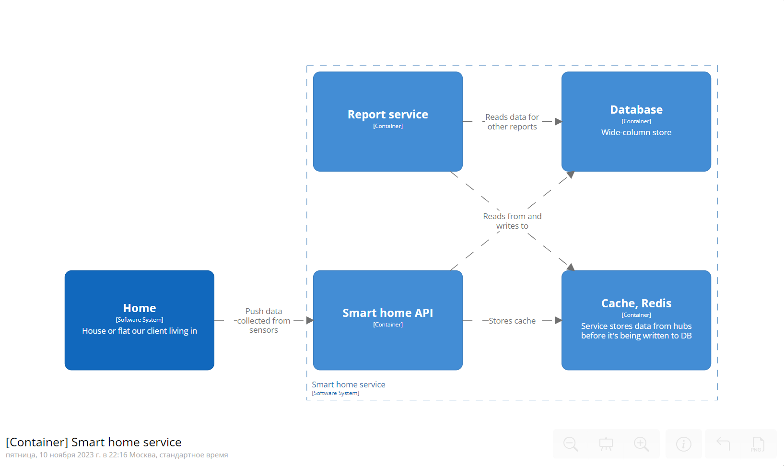
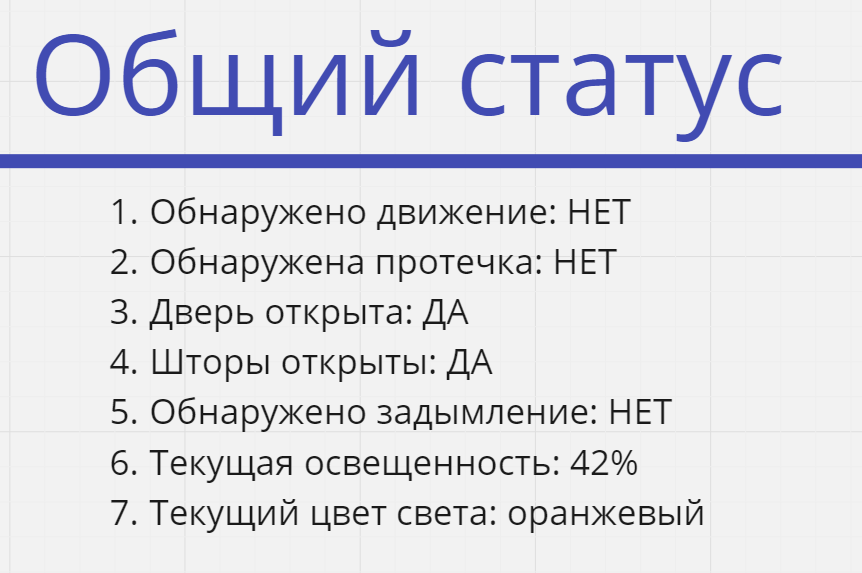
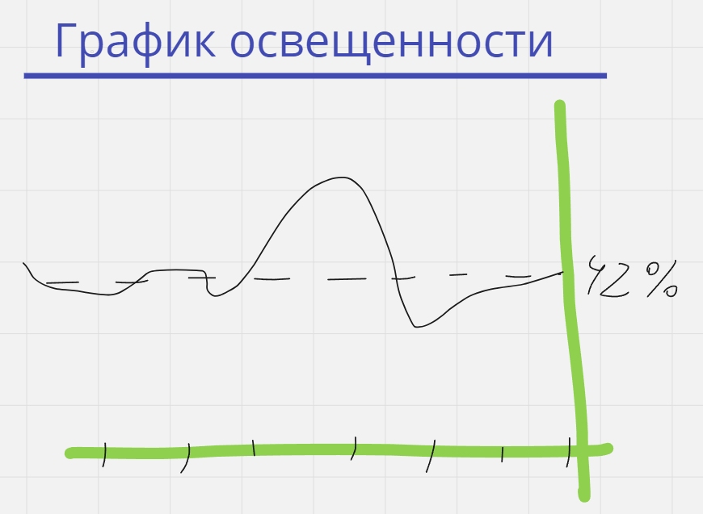
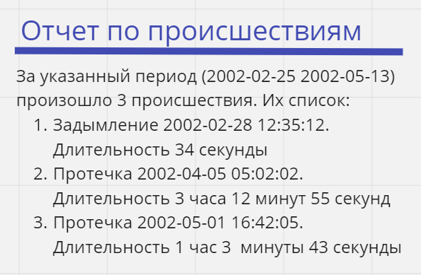

# 1. Модель

База данных используется столбцовая, по типу Apache Cassandra

Модель данных:  

# 2. Архитектурная диаграмма системы

Датчики находятся в домах, также в каждом доме находится один контроллер (hub) датчиков. Датчики каждые 10 секунд передают данные в контроллер, а контроллер передает данные в API нашего сервиса. Сервис, в свою очередь сохраняет данные в базу данных Apache Cassandra. Для того, чтобы весь поток данных сохранять в базу данных, данные с начала сохраняются в кэше (redis), далее с определенной периодичностью все накопившиеся данные сохраняются в базу данных (cassandra хорошо справляется с записью и чтением больших объемов данных). Данные в кэше хранятся также для формирования реал-тайм отчетов

Система является горизонтально расширяемой. Мы можем размещать столько троек (api, redis, db) сколько нужно

Данные весят очень много. Поэтому в сыром виде данные мы храним только месяц, спустя месяц удаляем, или агрегируем и сохраняем только отчетную информацию

# 3. Архитектура создания реал-тайм отчетов

Для агрегирования полученных с домов данных, мы получаем свежие данные с домов с кэша. Это делает report service, получая данные всех домов и сохраняя отчеты в своей базе данных

# 4. Архитектура создания долгосрочных отчетов

При формировании долгосрочных отчетов нам нужно получать все данные за указанный период. Для этого report service получает с базы данных данные всех домов за указанный период, используя преимущество столбцовых баз данных

# 5. Логические слои данных

1. Слой получения данных (датчики, сенсоры)
2. Слой сбора данных (контроллер, hub)
3. Слой обработки данных (api)
4. Слой хранения данных (кэш, база данных)
5. Слой визуализации данных (сервис отчетов)

Такое разделение слоев данных делает систему простой, понятной, горизонтально и вертикально расширяемой. К каждому слою явным образом соответствует конкретный компонент (компоненты) системы

# 6. Примеры отчетов

### реал тайм (мгновенные отчеты или отчеты которые обновляются в течение времени)

1. общий статус. Суммарная информация по текущим показателям датчиков  

2. график освещенности. График который обновляется с определенным периодом. Показывает уровень освещенности обнаруженный датчиком освещенности  

### долгосрочные отчеты

1. график происшествий. Информация о происшествиях в доме за указанный промежуток времени  

